|

|<h2>交通标识示意图|</h2>
|

#### 警告标志  

|  类型 | 文件夹名称 | 示例  | 备注   |
|  - | - | - | -  |
|  十字交叉路口         | |         |   |   |
|  卡字交叉路口         | |       |   |   |
|  卡字交叉路口         | |       |   |   |
|  Y 形交叉(左下侧)     | |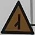         |   |   |
|  Y 形交叉(右下侧)     | |         |   |   |
|  Y 形交叉(左上侧)     | |         |   |   |
|  Y 形交叉(右上侧)     | |         |   |   |
|  Y 形交叉(左右侧)     | | |  | -  |
|  T 形交叉路口         | |         |   |   |
|  T 形交叉(左侧)       | |         |   |   |
|  T 形交叉(右侧)       | |         |   |   |
|  环形交叉路口         | |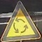         |   |   |
|  向右急转弯           | |         |   |   |
|  向左急转弯           | |         |   |   |
|  向左反向弯路         | |       |   |   |
|  向左反向弯路         | |       |   |   |
|  向右反向弯路         | |         |   |   |
|  连续弯路             | |         |   |   |
|  上陡坡               | |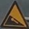         |   |   |
|  下陡坡               | |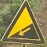         |   |  |
|  连续下坡             | |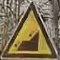         |   |   |
|  二侧变窄             | |         |   |  |
|  右侧变窄             | |         |   |  |
|  左侧变窄             | |         |   |  |
|  两侧变宽             | | |  | -  |
|  窄桥                 | |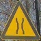         |   |   |
|  易滑                 | |         |   |   |
|  双向交通             | |         |   |   |
|  注意行人             | |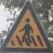         |   |   |
|  注意儿童             | |         |   |   |
|  注意牲畜             | |         |   |   |
|  渡口                 | |         |   |   |
|  注意野生动物         | |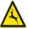         |   |   |
|  注意信号灯           | |         |   |   |
|  村庄                 | |         |   |  |
|  注意落石（左侧）     | |         |   |   |
|  注意落石（右侧）     | |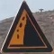         |   |   |
|  注意横风             | |         |   |   |
|  傍山险路（左侧）     | |         |   |   |
|  傍山险路（右侧）     | |         |   |  |
|  堤坝路（左侧）       | |         |   |   |
|  堤坝路（右侧）       | |         |   |   |
|  隧道                 | |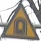         |   |   |
|  驼峰桥               | |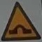         |   |    |
|  路面不平             | |         |   |    |
|  路面高突             | |         |   |    |
|  路面低洼             | |         |   |    |
|  过水路面             | |         |   |   |
|  有人看守的铁道路口   | |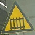         |   |   |
|  无人看守的铁道路口   | |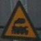         |   |   |
|  注意非机动车         | |         |   |   |
|  注意残疾人           | |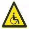         |   |   |
|  事故易发地段         | |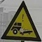         |   |   |
|  慢行                 | |       |   |   |
|  慢行                 | |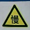       |   |   |
|  右侧绕行             | |         |   |  |
|  左侧绕行             | |         |   |   |
|  左右绕行             | |         |   |   |
|  注意危险             | |         |   |  |
|  施工                 | |         |   |   |
|  隧道开车灯           | |         |   |   |
|  注意潮汐车道         | |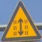         |   |   |
|  注意合流（左侧）     | |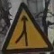         |   |   |
|  注意合流（右侧）     | |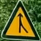         |   |   |
|  丁字平面交叉         | |         |   |   |
|  十字平面交叉         | |         |   |   |
|  注意保持车距         | |         |   |   |
|  注意前方车辆排队     | |         |   |   |
|  注意不利气象条件     | |         |   |   |
|  注意路面结冰         | |         |   |   |
|  注意雾天             | |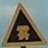         |   |   |
|  注意雨（雪）天       | |         |   |   |
|                       | | |  | -  |
|                       | | |  | -  |
| 注意有轨电车          | |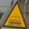 |  | -  |
|                       | | |  | -  |
| 注意高压              | | |  | -  |
|                       | | |  | -  |
|                       | | |  | -  |
|                       | | |  | -  |
|                       | |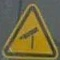 |  | -  |
| 建议速度              | | |   |   |
| 注意车道边少          | | |   |   |
|                       | | |   |   |
|  停车让行                         | | |  |   |
|  减速让行                         | | |  |   |
|  会车让行                         | |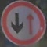 |  |   |
|  禁止通行                         | | |  |  |
|  禁止驶入                         | | |  |   |
|  禁止机动车驶入                   | | |  |   |
|  禁止载货汽车驶入                 | | |  |   |
|  禁止载货汽车右转                 | |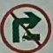 |  |   |
|  禁止载货汽车直行                 | | |  |   |
|  禁止电动三轮车驶入               | | |  |   |
|  禁止大型客车驶入                 | | |  |   |
|  禁止大型客车右转                 | | |  |   |
|  禁止小型客车驶入                 | | |  |   |
|  禁止挂车、半挂车驶入             | | |  |   |
|  禁止挂车、半挂车驶入             | |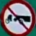 |  |   |
|  禁止挂车、半挂车左转             | | |  |   |
|  禁止挂车、半挂车右转             | |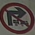 |  |   |
|  禁止挂车、半挂车右转             | | |  |   |
|  禁止拖拉机驶入                   | |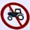 |  |   |
|  禁止三轮汽车、低速货车驶入       | |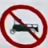 |  |   |
|  禁止三轮汽车、低速货车右转       | | |  |   |
|  禁止摩托车驶入                   | | |  |   |
|  禁止标志上所示的两种车辆驶入     | |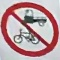 |  |   |
|  禁止各类非机动车进入             | | |  |   |
|  禁止畜力车进入                   | |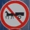 |  |   |
|  禁止人力客运三轮车进入           | | |  |  |
|  禁止人力货运三轮车进入           | | |  |   |
|  禁止人力车进入                   | | |  |  |
|  禁止行人进入                     | | |  |   |
|  禁止直行                         | |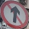 |  |   |
|  禁止向左转弯                     | | |  |   |
|  禁止向右转弯                     | |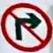 |  |   |
|  禁止向左向右转弯                 | | |  |   |
|  禁止直行和向左转弯               | | |  | |
|  禁止直行和向右转弯               | | |  |   |
|  禁止直行左转右转                 | |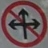 |  |  |
|  禁止左掉头                       | | |  |   |
|  禁止右掉头                       | |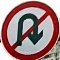 |  |   |
|  禁止小客车向右转弯               | | |  |   |
|  禁止载货汽车左转                 | | |  |   |
|  禁止鸣喇叭                       | ||  |   |
|                                   | | |  | -  |
|                                   | | |  | -  |
|                                   | | |  | -  |
|                                   | | |  | -  |
|                                   | | |  | -  |
|                                   | | |  | -  |
|                                   | | |  | -  |
|                                   | | |  | -  |
|                                   | | |  | -  |
|                                   | | |  | -  |
|                                   | | |  | -  |
|                                   | | |  | -  |
|                                   | | |  | -  |
|                                   | | |  | -  |
|                                   | | |  | -  |
|                                   | | |  | -  |
|                                   | | |  | -  |
|                                   | |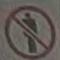 |  | -  |
|                                   | | |  | -  |
|                                   | | |  | -  |
|                                   | | |  | -  |
|  禁止吸烟                         | | |  |   |
|  禁止超车                         | | |  |   |
|  解除禁止超车                     | | |  |   |
|  禁止停车                         | | |  |   |
|  禁止车辆停放                     | |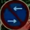 |  |   |
|  禁止长时停车                     | |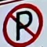|  |   |
|  禁止长时停车                     | ||  |   |
|  禁止长时停车                     | ||  |   |
|  限制宽度                         | |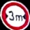 |  |   |
|  限制高度                         | | |  |   |
|  限制质量                         | | |  |  |
|  限制轴重                         | |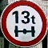 |  |   |
|  限制速度                         | |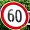 |  |  |
|  解除限制速度                     | |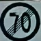 |  |  |
|  停车检查                         | | |  |   |
|  禁止运输危险物品车辆驶入         | | |  |    |
|  海关                             | | |  |   |
|  可变限速                         | | |  |   |
|  口岸停车检查                     | | |  |   |
|  直行                             | | |  |  |
|  向左转弯                         | | |  |  |
|  向右转弯                         | | |  |  |
|  直行和向左转弯                   | | |  |  |
|  直行和向右转弯                   | | |  |  |
|  向左和向右转弯                   | | |  |  |
|  靠右侧道路行驶                   | | |  |   |
|  靠左侧道路行驶                   | |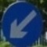 |  |  |
|  立体交叉直行和左转弯行驶         | | |  | -  |
|  立体交叉直行和右转弯行驶         | | |  | -  |
|  环岛行驶                         | | |  |  |
|  单行路向右                       | | |  |  |
|  单行路向左                       | | |  | -  |
|  单行路（直行）                   | | |  |  |
|  步行                             | |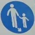 |  |  |
|  鸣喇叭                           | | |  | -  |
|  最低限速                         | | |  |  |
|  路口优先通行                     | | |  | -  |
|  会车先行                         | | |  | -  |
|  人行横道                         | | |  |   |
|  右转车道                         | | |  |   |
|  左转车道                         | | |  |   |
|  直行车道                         | | |  |   |
|  直行和右转合用车道               | |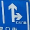 |  |   |
|  直行和左转合用车道               | | |  |   |
|  掉头车道                         | | |  |   |
|  掉头车道                         | | |  |   |
|  左掉头和左转合用车道             | | |  |   |
|  右掉头和右转合用车道             | | |  |   |
|  左掉头和直行合用车道             | | |  |   |
|  右掉头和直行合用车道             | | |  |   |
|  左右转合并车道                   | |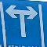 |  | -  |
|  公交线路专用车道                 | |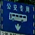 |  |   |
|  机动车行驶                       | | |  |  |
|  机动车车道                       | |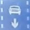 |  |  |
|  非机动车行驶                     | | |  |   |
|  非机动车车道                     | | |  | -  |
|  快速公交系统专用车道             | |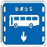 |  |  |
|  多乘员车辆专用车道               | | |  | -  |
|  停车位                           | | |  |   |
|  停车位                           | |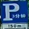 |  |   |
|  停车位                           | | |  |   |
|  停车位                           | | |  |   |
|  允许左掉头                       | |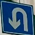 |  |   |
|  允许左掉头                       | | |  |   |
|  开车灯                           | | |  |   |
|  电动自行车行驶标志               | | |  | -  |
|  靠右侧车道行驶                   | | |  | -  |
|                                   | | |  | -  |
|                                   | | |  | -  |
|                                   | | |  | -  |
|                                   | | |  | -  |
|                                   | | |  | -  |
|                                   | | |  | -  |
|                                   | | |  | -  |
|                                   | | |  | -  |
|                                   | | |  | -  |
|                                   | | |  | -  |
|                                   | | |  | -  |
|                                   | | |  | -  |
|                                   | | |  | -  |
|                                   | | |  | -  |
|                                   | | |  | -  |
|                                   | | |  | -  |
|                                   | | |  | -  |
|                                   | | |  | -  |
|                                   | | |  | -  |
|                                   | | |  | -  |
|                                   | | |  | -  |
|                                   | | |  | -  |
|  残疾人专用停车位                 | | |  | -  |
|                                   | | |  | -  |
|                                   | | |  | -  |
|                                   | | |  | -  |
|                                   | | |  | -  |
|                                   | | |  | -  |
|                                   | | |  | -  |
|                                   | | |  | -  |
|                                   | | |  | -  |
|                                   | | |  | -  |
|                                   | | |  | -  |
|                                   | | |  | -  |
|                                   | | |  | -  |
|                                   | | |  | -  |
|                                   | | |  | -  |
|                                   | | |  | -  |
|                                   | | |  | -  |
|                                   | | |  | -  |
|                                   | | |  | -  |
|                                   | | |  | -  |
|                                   | | |  | -  |
|                                   | | |  | -  |
|                                   | | |  | -  |
|                                   | | |  | -  |
|                                   | | |  | -  |
|                                   | | |  | -  |
|                                   | | |  | -  |

<!-- 
|  陡坡标志加坡度值 | | |   |   |
|  叉形符号 | | |   |   |
|  斜杠符号 | | |   |   |
|  交通事故管理 | | |   |   |
|  建议 | | |   |   |
|  注意车道数变少 | | |   |   |-
|  线形诱导标 | | |   |   | -->

<!-- |  禁止电动自行车进入               | | |  |   |
|  禁止小客车向左转弯               | | |  |   |

|  区域禁止车辆长时停放             | | |  |   |
|  区域禁止车辆长时停放解除         | | |  |   |
|  区域禁止车辆停放                 | | |  |   |
|  区域禁止车辆停放解除             | | |  |   |
|  区域限制速度                     | | |  |   |
|  充电停车位标志 | | |  | -  |
|  专属停车位标志 | | |  | -  |
|  小型客车车道 | | |  | -  |
|  电动自行车车道 | | |  | -  |
|  不同的专用车道标志并设 | | |  | -  |
|  有轨电车专用车道 | | |  | -  |
|  校车专用停车位标志、校车停靠站点标志 | | |   |   | -->